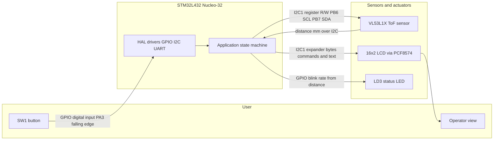

# Main Function Description

## Planned functionality

The finished system is a battery-powered distance-measurement demonstrator on an STM32L432 Nucleo-32. After power-on, the microcontroller initializes the VL53L1X time-of-flight sensor, the 16×2 I2C LCD, the user button SW1, and the supporting peripherals (GPIO, I2C, timers/SysTick). When initialization succeeds, the LCD shows **System Ready** to indicate that the device can start a measurement session.

During the presentation, the system will demonstrate interactive measurement control via SW1, live distance updates on the LCD, and automatic low-power sleep after idle time, including correct restore of a previously frozen reading.

---

### After switching on

When the device is turned on, the modules are initialized. The microcontroller initializes the distance sensor, LCD display, button SW1, and other required peripherals (clocks, GPIO, I2C bus shared by sensor and LCD). The LCD shows **System Ready** to indicate that the device is ready to perform measurements.

---

### Scenario 1 — SW1 interaction (ready → measure → hold)

When the user presses **SW1** the first time, the LCD remains/turns on in the ready state.  
When the user presses SW1 a **second** time, the system starts continuous distance measurement: the VL53L1X sends measured millimetre values over I2C to the microcontroller, which converts them to centimetres and shows them on the LCD.  
Pressing SW1 a **third** time freezes (**holds**) the current distance on the display while the LCD stays on. Pressing SW1 again leaves hold and returns to live measurement.

**Presentation demo:** press SW1 repeatedly to cycle Ready → Live distance → Hold → Live …

---

### Scenario 2 — Live distance refresh

When the measured distance changes during an active measurement (live mode), the LCD continuously refreshes the displayed distance in centimetres so the audience can see range changes in real time as the target moves.

**Presentation demo:** start live measurement, move a hand/target toward and away from the sensor, and show the LCD updating.

---

### Scenario 3 — 30 s idle sleep and wake with restore

When the user does not press any button for **30 seconds**, the device enters sleep mode: ranging stops and the LCD turns off (backlight/display off).  
When the user wakes the device by pressing SW1:
- if sleep began while a value was **frozen (hold)**, that same held value is shown again;
- otherwise the system returns to the ready/measurement path as defined by the last non-sleep state.

Additionally, while the device is awake (not sleeping), a **countdown of remaining on-time** is shown on the LCD so the user can see how long until automatic sleep.

**Presentation demo:** enter hold or live mode, wait ~30 s until the LCD switches off, then press SW1 and show restore behaviour and the on-time countdown.

---

## System block diagram

### Interfaces and data transfer

| Path | Interface | What is transferred |
|------|-----------|---------------------|
| SW1 → MCU | GPIO (digital input, pull-up; press = low) | Debounced edge events drive state changes (ready / live / hold / wake-from-sleep). |
| MCU ↔ VL53L1X | I2C1 (SCL PB6, SDA PB7), 7-bit address `0x29` | Configuration, start/stop ranging, data-ready status, distance in millimetres. |
| MCU ↔ LCD | Same I2C1 bus, PCF8574 backpack (`0x27` or `0x3F`) | HD44780 commands and 16-character text lines (status, distance, hold, countdown). |
| MCU → LD3 | GPIO (Nucleo green LED) | Optional visual feedback tied to measured distance while awake. |
| MCU ↔ PC (lab/debug) | USART2 VCP (PA2/PA15) | Optional UART prints; not required for the three presentation scenarios above. |

Shared **I2C1** is the main sensor/display bus: the application polls or reads the ToF sensor and writes LCD updates without a separate display bus. SysTick / `HAL_GetTick()` provides the 30 s idle timeout and the on-time countdown shown on the LCD.

## Potentiometer debug modes (always available)

In parallel with the SW1 presentation flow, the potentiometer (PA7 / ADC1_IN12) selects a debug layer:

| Pot range | Mode | Behaviour |
|-----------|------|-----------|
| 0–33% | UART TEST | Throttled VCP prints of pot% + distance while Live/Hold |
| 34–66% | STANDARD | Presentation LCD UI (System Ready / Dist / HOLD / On: Ns) |
| 67–100% | LCD DEBUG | `Update_LCD_Debug` (pot% + mm) while Live/Hold |

SW1 Ready/Live/Hold/Sleep behaviour is unchanged in all pot ranges.
