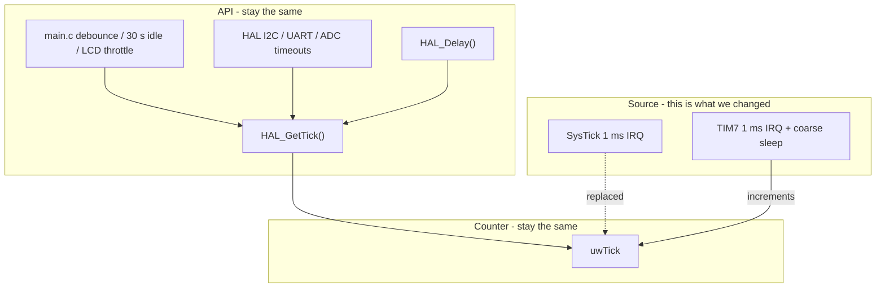

# Why `HAL_GetTick` stays — and how TIM7 + EXTI save energy

**Audience:** short oral / written explanation for the professor  
**Projects:** `Project_LCD`, `Dani/mcsd_project`  
**Related plan:** `LOW_POWER_WFI_plan.md`

This note answers two questions that look related but are not the same:

1. Why do we still call `HAL_GetTick()` everywhere after switching to TIM7?
2. Where does the actual power saving come from (TIM7 + EXTI)?

---

## 1. One-sentence summary

**TIM7 replaces SysTick as the clock *source*.  
`HAL_GetTick()` remains the clock *API*.  
EXTI lets the CPU sleep with almost no wake-ups when the UI is off.**

Most efficiency does **not** come from deleting `HAL_GetTick`.  
It comes from **waking the CPU less often**.

---

## 2. Three layers (do not mix them up)

Think of timekeeping as three stacked layers:

| Layer | What it is | Example in our code |
| --- | --- | --- |
| **API** (read time) | “What is the current millisecond?” | `HAL_GetTick()`, `HAL_Delay()` |
| **Counter** (shared value) | The global ms variable everyone reads | `uwTick` in the HAL |
| **Source** (who increments it) | Hardware IRQ that advances the counter | **was** SysTick → **now** TIM7 |



**Important:** changing the *source* automatically upgrades every caller of the *API*.  
That is why we did **not** rewrite dozens of `HAL_GetTick()` sites in `main.c` or in the ST HAL drivers.

---

## 3. Why `HAL_GetTick` must stay

### 3.1 It is the HAL contract

STM32 HAL assumes a millisecond tick:

- `HAL_GetTick()` → returns `uwTick`
- `HAL_Delay()` → busy-waits on `HAL_GetTick()`
- Blocking I2C / UART / ADC / RCC code uses `HAL_GetTick()` for timeouts

Our override in `stm32l4xx_hal_timebase_tim.c` only replaces the weak `HAL_InitTick` / `HAL_SuspendTick` / `HAL_ResumeTick`.  
After that, **the whole stack already runs on TIM7** without further edits.

### 3.2 Replacing the call sites would be worse

| If we… | Problem |
| --- | --- |
| Replace app `HAL_GetTick` with “read TIM7 CNT” | App and HAL would disagree on time; timeouts drift |
| Invent `app_get_ms()` that still returns `uwTick` | Same behaviour, only a rename |
| Delete timing and go fully event-driven | Lose 30 s sleep, debounce, countdown, LED period, HAL timeouts |

So keeping `HAL_GetTick` is not laziness — it is **correct reuse of the HAL timebase**.

### 3.3 What we *did* remove / replace

| Before | After | Why |
| --- | --- | --- |
| SysTick as active tick | TIM7 as active tick | Can suspend / reshape the wake period |
| `HAL_Delay(10)` at end of loop | `HAL_TickSleep(10…100)` | Sleep instead of spinning the CPU |
| Polling SW1 only while awake | EXTI3 + `__WFI` in `ST_SLEEP` | Wake only on button |

`HAL_GetTick()` calls for deadlines stay. The **idle wait** at the bottom of the loop is what changed.

---

## 4. Where the energy saving actually comes from

Energy on a Cortex-M4 drops mainly when the **CPU is not executing**.  
`__WFI()` puts the core into Sleep until an interrupt fires.

So the design goal is simple:

> Wake only when something useful happens.

### 4.1 Two operating regimes

| App state | Tick | Wake sources | Intent |
| --- | --- | --- | --- |
| UI alive (`READY` / `LIVE` / `HOLD` / wait) | TIM7 running (fine or coarse) | TIM7 (+ USART2 RX in Dani LCD DEBUG) | Keep ms accurate, sleep between loop iterations |
| Display off (`ST_SLEEP`) | TIM7 IRQ **suspended** | **SW1 EXTI3 only** | Deepest sleep we use without leaving RAM |

MCU mode is always **Sleep** (`__WFI`), not STM32 PWR Stop/Standby: RAM stays, so hold-restore and LCD state survive.

### 4.2 TIM7 while the UI is alive — fewer useless wake-ups

A classic 1 ms SysTick means:

- 1000 interrupts per second even if the loop only needs 10–100 ms cadence  
- Each interrupt wakes the CPU, runs the ISR, returns — for no app work

TIM7 still provides a 1 ms tick when fine resolution is needed, but the loop ends with `HAL_TickSleep(ms)`:

| Mode | Period | Effect |
| --- | --- | --- |
| **Fine** | 1 ms updates | Accurate `uwTick` while doing work / short waits |
| **Coarse** | one-shot of e.g. 10 ms or 100 ms | One wake for the whole idle window |

After a coarse sleep, `uwTick` is credited with the time really spent asleep (full period, or `CNT/10` if SW1 interrupted early).  
So `HAL_GetTick()` still reports **real milliseconds** — deadlines do not drift.

**Efficiency claim (UI awake):** same software timing semantics, far fewer periodic wake-ups than a permanent 1 kHz SysTick spin.

### 4.3 EXTI in `ST_SLEEP` — almost no periodic wake-ups

When the LCD has timed out (30 s idle):

1. `HAL_SuspendTick()` → TIM7 update IRQ off  
2. `__WFI()` → CPU sleeps  
3. Only **EXTI3** (SW1 on PA3) is meant to wake the app  

No 1 ms tick. No 100 ms tick. The CPU can stay asleep until the user presses the button.

**Efficiency claim (display off):** wake rate drops from “every few ms” to “on button press”.

```mermaid
sequenceDiagram
  participant Loop as main loop
  participant TIM7 as TIM7 tick
  participant CPU as CPU
  participant SW1 as SW1 EXTI3

  Note over Loop,SW1: UI alive
  Loop->>TIM7: HAL_TickSleep(10..100 ms)
  TIM7-->>CPU: wake after idle window
  Loop->>Loop: poll UI / sensor / LCD

  Note over Loop,SW1: ST_SLEEP
  Loop->>TIM7: HAL_SuspendTick()
  Loop->>CPU: __WFI()
  Note over CPU: no tick wakes
  SW1-->>CPU: falling edge
  Loop->>TIM7: HAL_ResumeTick()
  Loop->>Loop: restore UI
```

---

## 5. How to explain it in ~60 seconds

Use this script:

1. **Problem:** A 1 ms SysTick wakes the CPU 1000×/s even when the app only needs 10–100 ms decisions, and while the screen is off that tick is pure waste.  
2. **API vs source:** We keep `HAL_GetTick()` as the millisecond API used by our code and by HAL drivers. We only change the *source* that increments `uwTick`: SysTick → TIM7.  
3. **While awake:** `HAL_TickSleep()` puts TIM7 in a longer one-shot, so the loop sleeps for 10–100 ms in one go; `uwTick` is still updated correctly.  
4. **While in app sleep:** we suspend the tick and wait on EXTI (SW1). Energy saving is “CPU asleep until button”, not “delete GetTick”.  
5. **What we did not do:** STM32 Stop/Standby (would lose easy RAM restore), and we did not fork HAL by replacing every timeout.

---

## 6. Common professor questions (short answers)

**Q: Why still so many `HAL_GetTick` in `main.c`?**  
A: They are *deadlines* (debounce, 30 s idle, LCD refresh). TIM7 feeds the same counter those calls read. Removing them would remove the behaviour, not save power.

**Q: Is TIM7 “instead of” `HAL_GetTick`?**  
A: No. TIM7 is instead of **SysTick**. `HAL_GetTick` stays.

**Q: Could you read TIM7 registers from the app?**  
A: Possible, but then the app and HAL timeouts would use different clocks. Keeping one HAL tick is the safe design.

**Q: Where is most of the gain?**  
A: (1) Coarse TIM7 sleep while the UI runs → fewer periodic wakes.  
(2) EXTI-only sleep with tick suspended → near-zero periodic wakes.  
Not from rewriting GetTick call sites.

**Q: Why not MCU Stop mode?**  
A: We need RAM and a simple restore after SW1; Sleep + `__WFI` is enough for this lab and keeps HAL/LCD/hold state intact.

---

## 7. Mapping to files (if asked where it lives)

| Topic | File |
| --- | --- |
| TIM7 timebase + `HAL_TickSleep` | `Core/Src/stm32l4xx_hal_timebase_tim.c` |
| TIM7 / EXTI3 IRQs | `Core/Src/stm32l4xx_it.c` |
| Suspend + `__WFI` in `ST_SLEEP`, coarse sleep when awake | `Core/Src/main.c` |
| SW1 as EXTI falling edge | `MX_GPIO_Init` in `main.c` |
| Design plan | `LOW_POWER_WFI_plan.md` |

---

## 8. Bottom line

| Myth | Fact |
| --- | --- |
| “TIM7 means delete `HAL_GetTick`” | TIM7 *implements* the tick that `HAL_GetTick` reads |
| “Efficiency = fewer GetTick calls” | Efficiency = CPU in `__WFI` with fewer interrupts |
| “EXTI replaces the tick” | EXTI replaces the tick **only while the display is off** |
| “We rewrote all timing users” | We rewired the timebase once; all users followed automatically |

**Professor takeaway:** we kept the HAL millisecond API, moved the timebase to TIM7 so we can shape and suspend wake-ups, and used EXTI so button-wait sleep is not interrupted by a periodic tick.
